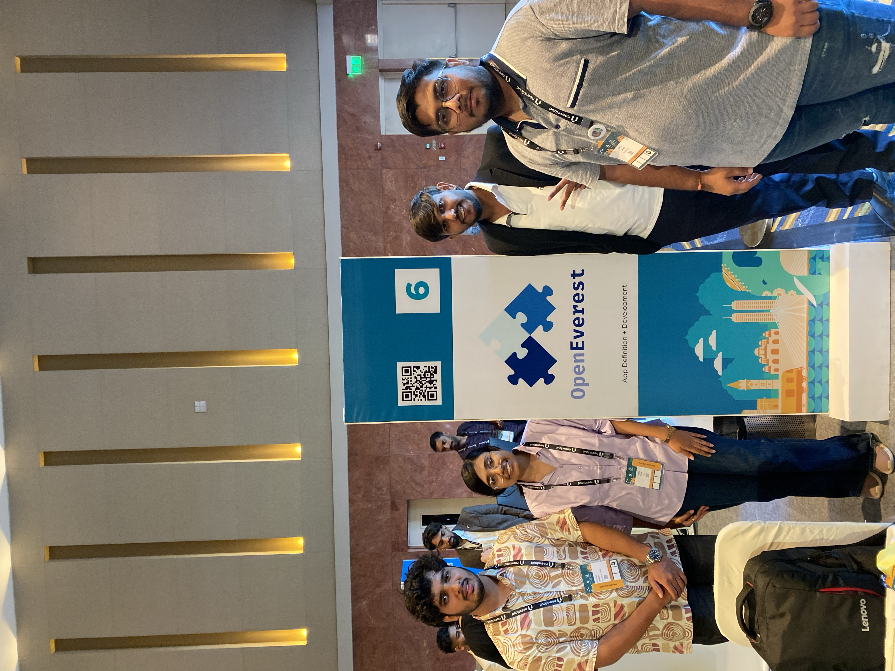
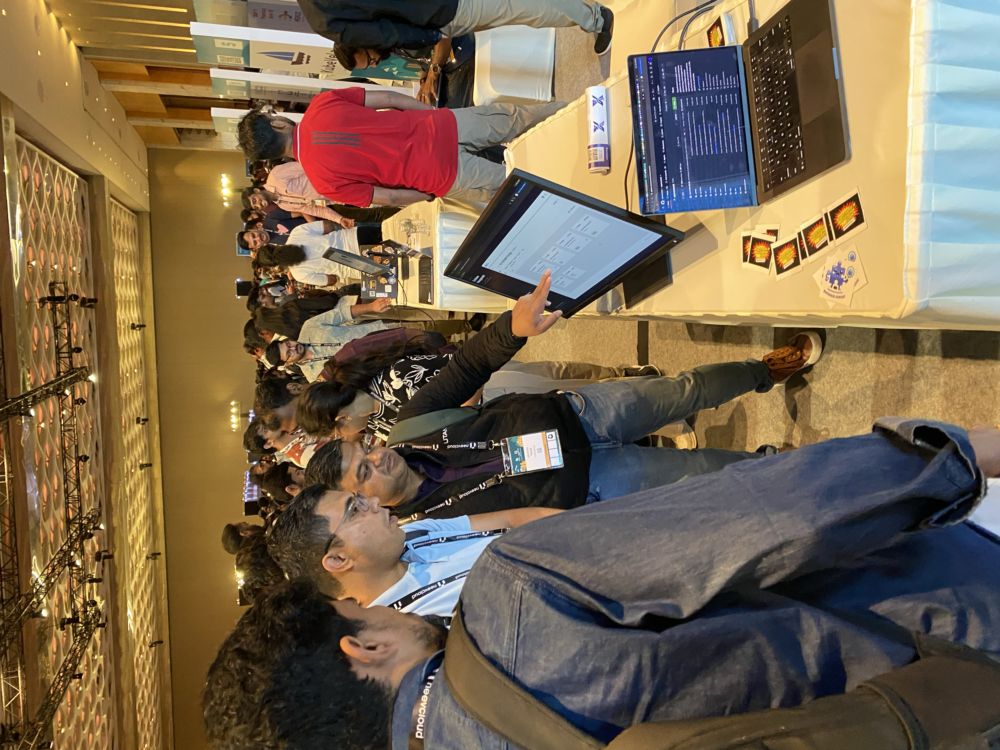
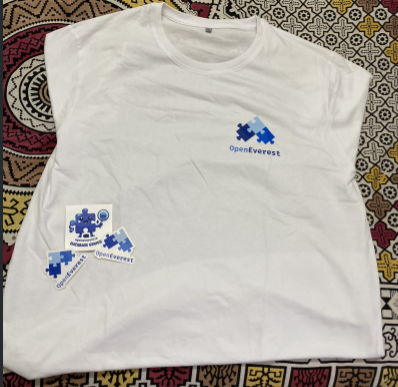

OpenEverest was present at KubeCon + CloudNativeCon India 2026, held in Mumbai on June 18–19. The booth was represented by Neel Shah, Vijeta Priya, and Atharva Mhaske, reflecting a strong community-led presence for the project.**

The event created strong visibility for OpenEverest among cloud-native practitioners, platform engineers, DevOps leaders, and ecosystem advocates, with more than **200 attendees** engaging at the booth!

Attendees who were stopping by the booth could learn about:

* v2 Developer Preview — recently released the first dev preview of OpenEverest v2, a major rework of the platform
* Running PostgreSQL, MySQL, and MongoDB on Kubernetes with a single control plane
* Backups, restores, and point-in-time recovery across database engines
* Contributing to OpenEverest — including the LFX Mentorship program
* What’s on the roadmap

The outcome?

* More than 200 people visited the booth, showing strong, sustained audience interest during the event.
* Swag demand was exceptionally high: **75 t-shirts and around 100 stickers** were fully distributed within two hours
* The most common question was focused on the database support
* Conversations moved beyond curiosity into practical adoption topics such as installation, scale, and support for different database types, 

Overall we can see that OpenEverest was being assessed as a serious project rather than only a concept.

What can we say? The event was a blast! Our team had some great conversations about the software and we hope to go back next year!

**You didn’t manage to be at KubeCon, but you want to connect?**
* [Star the project on GitHub](https://github.com/openeverest/openeverest)
* [Join the conversation on our community channels](https://cloud-native.slack.com/archives/C09RRGZL2UX)
* [Follow us on LinkedIn](https://www.linkedin.com/company/openeverest/)
* [Browse other upcoming events](https://openeverest.io/resources/)