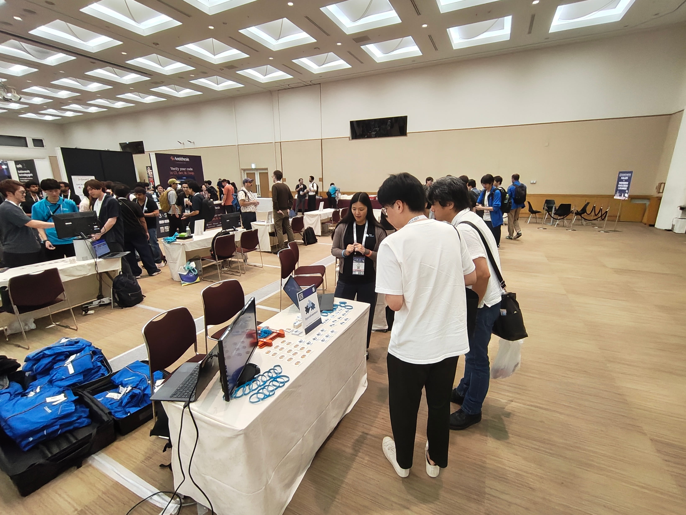
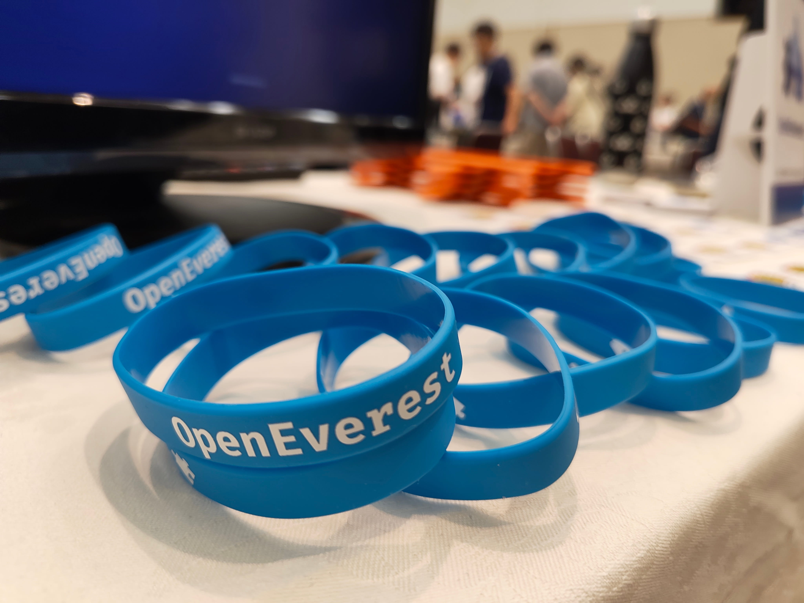
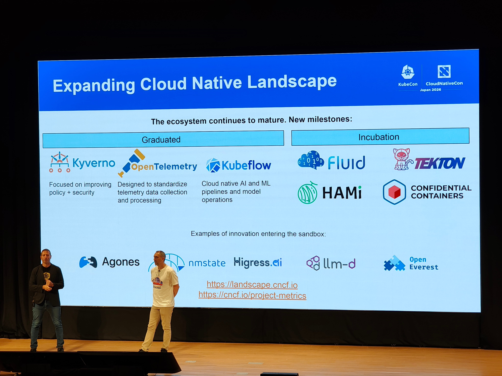
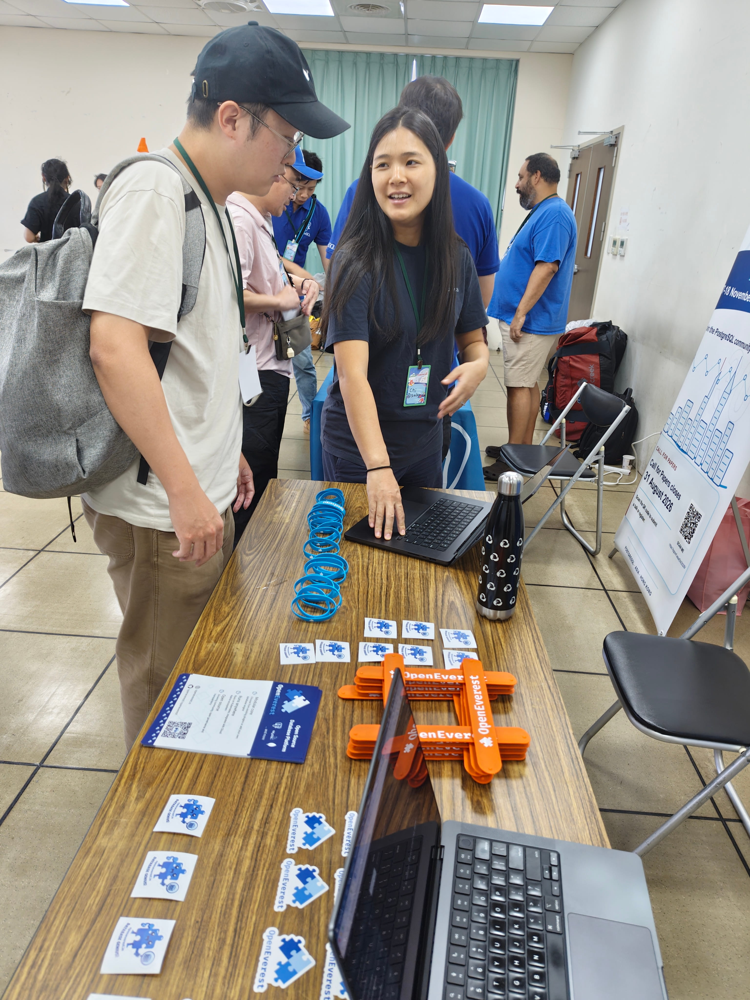
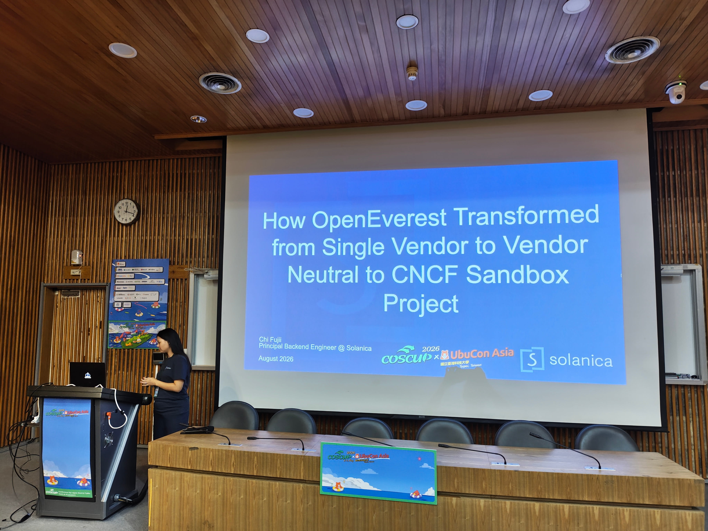

In the middle of the summer, the two of us set off on what we called our Asian tour: two conferences, two countries, and two very different crowds. First came [KubeCon + CloudNativeCon Japan](https://events.linuxfoundation.org/kubecon-cloudnativecon-japan/program/schedule/) in Yokohama, then [COSCUP](https://coscup.org/2026/en/) in Taipei. The two events could hardly have been more different, and that is what made the trip worth writing about. In this post we want to share what we saw, the conversations we had, and what we learned.

  

    <h3>🇯🇵 KubeCon + CloudNativeCon Japan</h3>
    
Yokohama · 28–30 July 2026

    <ul>
      <li>Project pavilion booth (day 2)</li>
      <li>ICs to large enterprises: Fujitsu, Toyota, Panasonic, NEC, Hitachi</li>
      <li>Lots of AI talks, data underneath</li>
      <li>Enterprise and focused</li>
    </ul>
  

  

    <h3>🇹🇼 COSCUP x UbuCon Asia</h3>
    
Taipei (NTUST campus) · 8–9 August 2026

    <ul>
      <li>3 talks and a community booth</li>
      <li>Mostly students, some companies and investors</li>
      <li>Ubuntu diamond sponsor, FOSDEM-style</li>
      <li>Grassroots, free and open</li>
    </ul>
  

## KubeCon Japan

The official name of the event is [KubeCon + CloudNativeCon Japan 2026](https://events.linuxfoundation.org/kubecon-cloudnativecon-japan/program/schedule/), and it took place 28–30 July in Yokohama. We did not have any talks this time, but we ran a project pavilion booth on day 2, which left the first day free to walk the sessions.

The keynotes focused on the cloud native community in Japan and on AI. According to the [State of Cloud Native Development in Japan 2026 report](https://www.cncf.io/wp-content/uploads/2026/07/DN31-JAPAN-State-of-Cloud-Native-Development-1.pdf), around 950,000 developers in Japan are now cloud native — about 41% of the country's developer population, slightly above the global average of 39%. That is a lot of cloud native adoption for one country. AI was the other big theme: it felt like most of the talks were about agents and LLMs, which was expected.

But we came to learn about the state of data on Kubernetes in Japan, and we picked up three recurring threads: object storage, MariaDB, and TiDB. Object storage came up mostly in the context of AI — teams need somewhere to keep artifacts like model weights, datasets, checkpoints, and backups. MariaDB and TiDB were more popular than we expected, arguably more visible than PostgreSQL. Teams run them in production on Kubernetes, on VMs, and on-prem, and more than one person told us they run them on plain StatefulSets, with no operator at all.

  
  
  

  <a href="#kj-1">1</a>
  <a href="#kj-2">2</a>
  <a href="#kj-3">3</a>

What stood out was the turnout and how many people wanted to learn about projects across the cloud native ecosystem — something we felt on day 2 at the booth. The conversations were practical: demos, feature requests, and honest feedback. The audience ranged from individual contributors to people at large Japanese companies like Fujitsu, Toyota, Panasonic, and NEC. Folks from Hitachi told us the OpenEverest UI looked clean and easy to read. Language was rarely a barrier: Chi moved between English and Japanese, but many booth visitors were comfortable in English. KubeCon was a good place to meet large enterprises and understand how they run databases.

To anyone who regularly attends KubeCon in North America or Europe: we recommend KubeCon Japan. You get a similar quality of conversation in a smaller, more focused setting.

## COSCUP

[COSCUP x UbuCon Asia 2026](https://coscup.org/2026/en/) happened on 8–9 August in Taipei, Taiwan, and it was very different. The format is close to FOSDEM — a university campus (NTUST), no entrance fee, and a community-driven feel. This time we came with [three talks and a booth](https://openeverest.io/events/coscup-2026/), the booth provided free to OpenEverest as an open source project.

  
  

  <a href="#cs-1">1</a>
  <a href="#cs-2">2</a>

The crowd was mostly students, with some companies and a few investors — far fewer than at KubeCon Japan. Day two was dampened by Typhoon Dolphin, which kept part of the audience at home. A few things stood out:

- **It's a student event first.** Attendance is hard to pin down, but it felt close to 1,000 people.
- **MySQL and PostgreSQL both had booths** and plenty of staff on hand.
- **Ubuntu was a diamond sponsor** and, frankly, everywhere.

Our booth was on the 4th floor with PostgreSQL, the Kotlin community, and others, while the main booth hall was on the 3rd — where MySQL had also set up. It is tempting to read that as another sign that MySQL is bigger than PostgreSQL in APAC, but that might just be us. The bigger takeaway: many people who stopped by our booth were not in tech, so conversations about databases on Kubernetes did not go as deep as in Yokohama.

## What we heard on the ground

Across both events, the same themes kept surfacing. We've grouped the field notes below — expand whichever one you're curious about.

Object storage, mostly for AI

S3-compatible storage came up often, usually in an AI context. Teams training and serving models need somewhere to keep model weights, datasets, checkpoints, logs, and backups, and object storage on Kubernetes is increasingly where that lands.

MariaDB and TiDB are popular in APAC

Both showed up more than we are used to seeing elsewhere, TiDB especially at KubeCon. Plenty of teams run them in production across Kubernetes, VMs, and on-prem.

StatefulSets over operators

A recurring pattern: teams running databases on plain StatefulSets, no operator. Chi spoke with about four people running MySQL on Kubernetes; three used StatefulSets directly, all for internal, non-public applications, and one was not sure which operator was used. That points to two groups: engineers comfortable managing databases themselves, and people who just consume databases on Kubernetes. On the PostgreSQL side, CloudNativePG was the only operator anyone named, and we met a couple of MS SQL users too.

Cloud vs. self-hosting, and cost

Managed services in the public cloud are still very popular, though many people brought up rising costs. Data sovereignty was not a common concern here, unlike in Europe. Self-hosting is growing, including for AI, where tools like CastAI let teams self-host open source models and cut costs. We also had a good chat with 3-shake, an SRE-as-a-service company: they are happy to run databases on Kubernetes, but their clients still want managed cloud services.

Individuals ready, enterprises cautious

At KubeCon, databases on Kubernetes are treated as a real option. At COSCUP, people were more skeptical, even when they already use Kubernetes for stateless workloads. Our read: individual engineers are ready for databases on Kubernetes, most large enterprises are not yet, and a lot of the real workload today is internal tooling.

A nice recurring theme: several people we spoke with already use OpenEverest, here and there. One had picked it up in a previous role and still reaches for it whenever they need to spin up a database.

## Wrapping up

Two conferences, one continent, and a wide range of perspectives — from Japanese enterprises evaluating databases on Kubernetes at scale to Taiwanese students meeting the idea for the first time. The through-line was consistent: interest in running data on Kubernetes is real and growing, and the gap between "I can run this myself" and "my company trusts this" is where a lot of the work still is. That gap is what OpenEverest is built for. We came back with plenty of ideas, and we will be back.

In fact, the tour is not over: our next stop is [KubeCon + CloudNativeCon China](https://openeverest.io/events/kubecon-china-2026/) in September. If you will be there, come say hi.

Didn't manage to catch us on the tour, but want to connect?

- **Contribute:** dive into our [Good First Issues](https://github.com/orgs/openeverest/projects/2) and [repositories](https://github.com/openeverest).
- **Chat:** join the conversation in the CNCF Slack (channel: [#openeverest-users](https://cloud-native.slack.com/archives/C09RRGZL2UX)).
- **Explore:** see where we'll be next on our [events page](https://openeverest.io/resources/).

  <a href="https://cloud-native.slack.com/archives/C09RRGZL2UX" target="_blank" rel="noopener noreferrer" style="display:inline-flex;align-items:center;gap:8px;background-color:#4A154B;color:#fff;text-decoration:none;padding:10px 20px;border-radius:6px;font-weight:600;font-size:15px;">
    <svg xmlns="http://www.w3.org/2000/svg" width="20" height="20" viewBox="0 0 122.8 122.8"><path d="M25.8 77.6c0 7.1-5.8 12.9-12.9 12.9S0 84.7 0 77.6s5.8-12.9 12.9-12.9h12.9v12.9zm6.5 0c0-7.1 5.8-12.9 12.9-12.9s12.9 5.8 12.9 12.9v32.3c0 7.1-5.8 12.9-12.9 12.9s-12.9-5.8-12.9-12.9V77.6z" fill="#e01e5a"/><path d="M45.2 25.8c-7.1 0-12.9-5.8-12.9-12.9S38.1 0 45.2 0s12.9 5.8 12.9 12.9v12.9H45.2zm0 6.5c7.1 0 12.9 5.8 12.9 12.9s-5.8 12.9-12.9 12.9H12.9C5.8 58.1 0 52.3 0 45.2s5.8-12.9 12.9-12.9h32.3z" fill="#36c5f0"/><path d="M97 45.2c0-7.1 5.8-12.9 12.9-12.9s12.9 5.8 12.9 12.9-5.8 12.9-12.9 12.9H97V45.2zm-6.5 0c0 7.1-5.8 12.9-12.9 12.9s-12.9-5.8-12.9-12.9V12.9C64.7 5.8 70.5 0 77.6 0s12.9 5.8 12.9 12.9v32.3z" fill="#2eb67d"/><path d="M77.6 97c7.1 0 12.9 5.8 12.9 12.9s-5.8 12.9-12.9 12.9-12.9-5.8-12.9-12.9V97h12.9zm0-6.5c-7.1 0-12.9-5.8-12.9-12.9s5.8-12.9 12.9-12.9h32.3c7.1 0 12.9 5.8 12.9 12.9s-5.8 12.9-12.9 12.9H77.6z" fill="#ecb22e"/></svg>
    Join Slack
  </a>
  <a href="https://github.com/openeverest/openeverest" target="_blank" rel="noopener noreferrer" style="display:inline-flex;align-items:center;gap:8px;background-color:#24292f;color:#fff;text-decoration:none;padding:10px 20px;border-radius:6px;font-weight:600;font-size:15px;">
    <svg xmlns="http://www.w3.org/2000/svg" width="20" height="20" viewBox="0 0 16 16" fill="#fff"><path d="M8 .25a7.75 7.75 0 1 0 0 15.5A7.75 7.75 0 0 0 8 .25zm0 1.5a6.25 6.25 0 0 1 1.97 12.18c-.31.06-.42-.13-.42-.3v-1.05c0-.36-.01-1.02-.49-1.4 1.62-.18 2.5-.88 2.5-2.57 0-.57-.2-1.1-.53-1.49.05-.14.23-.7-.05-1.47 0 0-.44-.14-1.44.54a5.02 5.02 0 0 0-2.62 0C5.93 6.6 5.49 6.74 5.49 6.74c-.28.77-.1 1.33-.05 1.47-.33.39-.53.92-.53 1.49 0 1.69.88 2.39 2.5 2.57-.31.27-.43.67-.47 1.04-.42.19-1.5.52-2.16-.62 0 0-.39-.71-1.13-.76 0 0-.72-.01-.05.45 0 0 .48.23.82 1.08 0 0 .43 1.32 2.49.87v.75c0 .17-.11.36-.42.3A6.25 6.25 0 0 1 8 1.75z"/></svg>
    Star the Repo
  </a>

