## Table of Contents

- [Introduction](#introduction)
- [Prerequisites](#prerequisites)
- [Setting Up RustFS](#1-setting-up-rustfs)
- [Creating a Bucket in RustFS](#2-creating-a-bucket-in-rustfs)
- [Connecting RustFS to OpenEverest](#3-connecting-rustfs-to-openeverest)
- [Deploying a Database Cluster and Setting Up Scheduled Backups](#4-deploying-a-database-cluster-and-setting-up-scheduled-backups)
- [Taking a Backup](#5-taking-a-backup)
- [Restoring from a Backup](#6-restoring-from-a-backup)
- [Another way to restore: Create DB from a backup](#7-another-way-to-restore-create-db-from-a-backup)
- [Conclusion](#8-conclusion)

---

## Introduction

Backups are an important part of running any database in production. They help protect your data from accidental deletion, hardware failures, software bugs, or other unexpected issues. A good backup strategy ensures that you can recover your data whenever needed.

OpenEverest provides an easy way to create and restore database backups. It supports S3-compatible object storage, which means you can store backups on cloud providers like AWS S3, or on your own self-hosted storage.

In this guide, we will use RustFS, a self-hosted, open-source, S3-compatible object storage, instead of a cloud service. This gives you full control over your data while reducing dependency on third-party providers.

Whether you are setting up a home lab, testing locally, or building an on-premises environment, this guide walks through the complete process: configuring RustFS, connecting it to OpenEverest, creating backups, and restoring your database when needed.

---

## Prerequisites

Before you start, make sure you have:

- A running Kubernetes cluster (k3s, kind, or any other distribution)
- OpenEverest installed, with at least one database engine enabled (PostgreSQL, in this guide)
- `kubectl` configured for your cluster
- `helm` installed
- Basic familiarity with the OpenEverest UI

> **Note:** This guide assumes OpenEverest is already installed and running. If you haven't set that up yet, check out [Running Databases on Kubernetes Locally with OpenEverest](https://openeverest.io/blog/running-openeverest-on-my-laptop/) first, then come back here.

---

## 1. Setting Up RustFS

RustFS is installed using Helm. By default, it runs in distributed mode with four replicas for high availability. For this guide, we only need a simple test environment, so we will use standalone mode. This runs a single RustFS instance and is enough for testing and learning.

### Step 1.1: Add the RustFS Helm repo

```bash
helm repo add rustfs https://charts.rustfs.com
helm repo update
```

### Step 1.2: Check the default settings

Before we change anything, let's see what settings RustFS uses by default:

```bash
helm show values rustfs/rustfs
```

Helm does not remove these defaults when we use an override file. It only changes the parts we mention. Everything else stays the same.

### Step 1.3: Create an override-values.yaml file

```bash
cat <<EOF > override-values.yaml
replicaCount: 1

mode:
  standalone:
    enabled: true
  distributed:
    enabled: false

secret:
  rustfs:
    access_key: <your-access-key>
    secret_key: <your-secret-key>

ingress:
  enabled: false
EOF
```

Replace `<your-access-key>` and `<your-secret-key>` with your own values. Using your own credentials is a good practice and helps keep your storage secure.

### Step 1.4: Install RustFS using the override file

```bash
kubectl create namespace rustfs
helm install rustfs rustfs/rustfs -n rustfs -f override-values.yaml
```

### Step 1.5: Check that it's running

```bash
$ kubectl get pods -n rustfs

NAME                          READY   STATUS    RESTARTS   AGE
rustfs-c8dd447c9-4wx2q         1/1     Running   0          47s
```

```bash
$ kubectl get svc -n rustfs

NAME         TYPE        CLUSTER-IP     EXTERNAL-IP   PORT(S)             AGE
rustfs-svc   ClusterIP   10.43.221.127  <none>        9000/TCP,9001/TCP   3m54s
```

You should see one pod running, and a service with two ports:
- **9000** — used to store and fetch data (this is what OpenEverest talks to)
- **9001** — the web console, where you can view your files

### Step 1.6: Open the web console

Forward the ports so you can open it in your browser:

```bash
kubectl port-forward -n rustfs svc/<service-name> 9000:9000 9001:9001
```

Now open `http://localhost:9001` in your browser and log in using your access key and secret key.

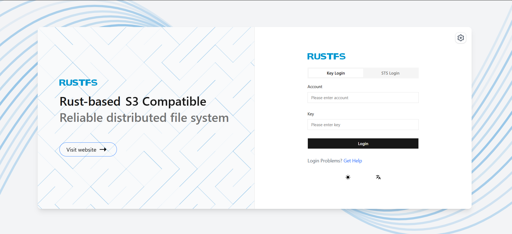

---

## 2. Creating a Bucket in RustFS

Once you can open the RustFS web console, the next step is to create a bucket. A bucket is just a storage container, like a folder, where your backups will be saved.

### Step 2.1: Log in to the console

Open `http://localhost:9001` in your browser and log in using the access key and secret key you set earlier.

### Step 2.2: Create a bucket

1. Go to **Browser** in the left menu.
2. Click **Create Bucket**, in the top right.
3. Give it a name, for example `postgresql-backups`.
4. Click **Create**.

Your new bucket should now appear in the bucket list.

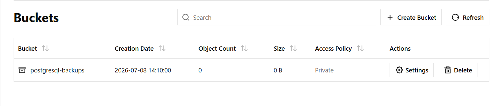

### Step 2.3: Note down what you'll need next

Before moving on, make sure you have these ready:

- **Bucket name**: `postgresql-backups`
- **Access key and secret key**: the same ones you set in `override-values.yaml`
- **Endpoint**: we'll need this in the next step, when connecting RustFS to OpenEverest. The endpoint will look like this:

```
http://<service-name>.rustfs.svc.cluster.local:9000
```

---

## 3. Connecting RustFS to OpenEverest

Now that RustFS is running and you have a bucket ready, the next step is to add it to OpenEverest as a backup storage.

### Step 3.1: Open the Backup Storages page

In the OpenEverest UI, go to **Settings → Backup Storages**.

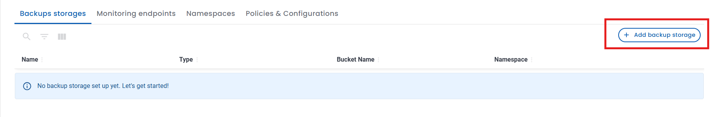

### Step 3.2: Click Add backup storage

On the UI, you will see a form like this. Fill in the form with the following details:

- **Name:** `rustfs-backup-storage`
- **Namespace:** `everest`
- **Type:** `S3 Compatible`
- **Bucket Name:** `postgresql-backups`
- **Region:** `us-east-1`
- **Endpoint:** `http://<service-name>.rustfs.svc.cluster.local:9000`
- **Access Key:** your RustFS access key
- **Secret Key:** your RustFS secret key
- **Verify TLS certificate:** Unchecked
- **Force path-style URL access:** Checked

### Step 3.3: Click Add

OpenEverest will try to connect to RustFS using these details. If everything is correct, the storage will be added successfully, and you'll see it listed under Backup Storages.

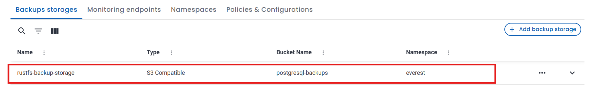

> **Note:** Region isn't used directly by RustFS, but the field is still required by the client form, so any AWS-style region string works. Force path-style URL access should stay checked, because RustFS supports path-style addressing by default. Since this guide does not configure TLS certificates, RustFS is running over plain HTTP here, so Verify TLS certificate is unchecked and the endpoint uses `http://`. RustFS also supports HTTPS if you configure TLS certificates in your deployment; in that case, enable certificate verification and use `https://` in the endpoint.

---

## 4. Deploying a Database Cluster and Setting Up Scheduled Backups

With RustFS connected, the next step is to create a database. This guide uses PostgreSQL.

### Step 4.1: Create a new database

From the OpenEverest homepage, click **Create database**.

### Step 4.2: Basic information

Select **PostgreSQL** as the engine. On this first screen, you'll set:

- **Namespace** — the namespace where this database will run, for example `everest`
- **Display name** — a name for your database, for example `postgresql-384`
- **Database version** — the PostgreSQL version to use, for example `18.3`

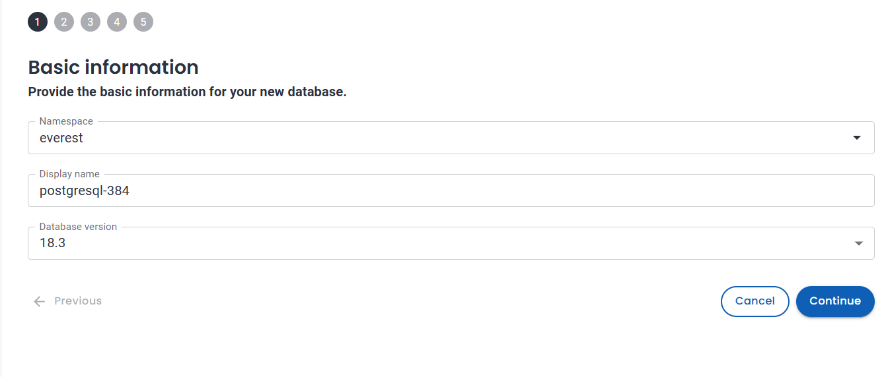

Click **Continue**.

### Step 4.3: Resources

Next, configure the resources for your database:

- **Number of nodes**
- **Resource size per node**
- **PG Bouncers**

Pick whatever fits your environment.for a small test setup, 1 node with the Small size is enough.

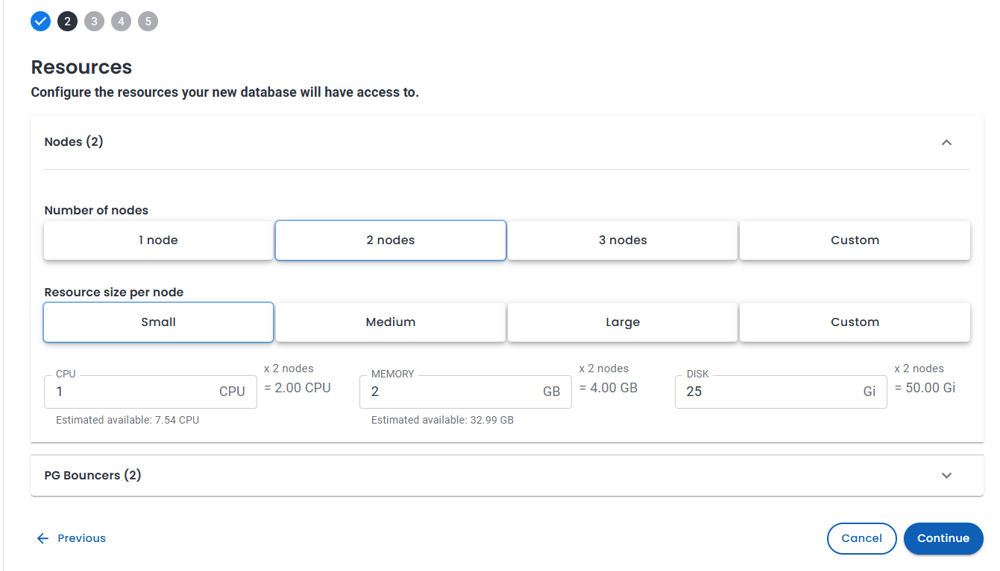

Click **Continue**.

### Step 4.4: Set the backup storage

As you move forward in the wizard, you'll reach a **Backups** step. Here, you can:

- Select `rustfs-backup-storage` as your backup storage location
- Turn on a **backup schedule**, for example daily at a fixed time
- Set a **retention policy**, which controls how many backup copies to keep at once

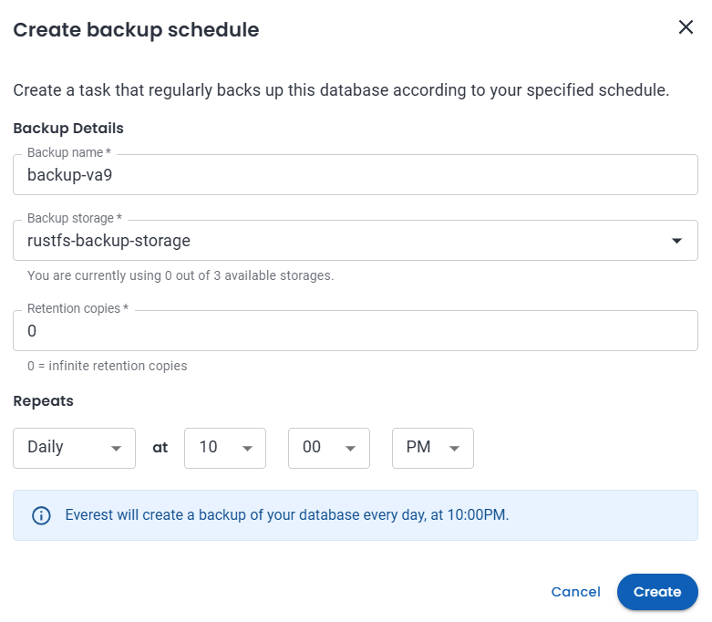

### Step 4.5: Finish and create

Complete the rest of the wizard and click **Create**. OpenEverest will provision the cluster — this may take a few minutes.

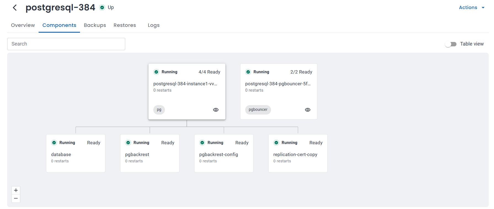

### Step 4.6: Confirm it's running

```bash
$ kubectl get pods -n everest

NAME                                               READY   STATUS      RESTARTS   AGE
percona-postgresql-operator-5c4dd655bd-9hmzm       1/1     Running     0          83m
percona-server-mongodb-operator-7bb69bb49b-nq2xp   1/1     Running     0          83m
percona-xtradb-cluster-operator-684cd7646c-286q6   1/1     Running     0          83m
postgresql-384-backup-tssw-6chzs                   0/1     Completed   0          102s
postgresql-384-instance1-vvmn-0                    4/4     Running     0          118s
postgresql-384-pgbouncer-5fd7c9df7d-xflst          2/2     Running     0          115s
postgresql-384-repo-host-0                         2/2     Running     0          116s
```

You should see the new Postgres instance, along with its pgBouncer and repo-host pods, all in `Running` state.

---

## 5. Taking a Backup

Now that the database is running and connected to RustFS, let's take a backup and confirm it gets stored in our self-hosted S3 bucket.

### Step 5.1: Go to the Backups tab

Open your database cluster in the OpenEverest UI, then click the **Backups** tab.

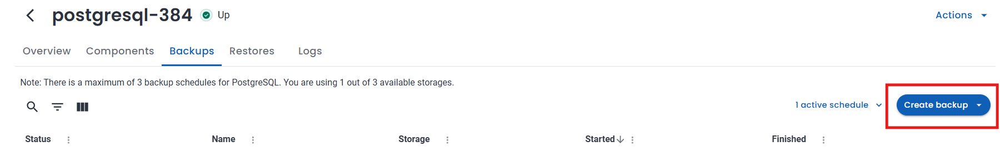

### Step 5.2: Create a backup

Click **Create backup**, choose `rustfs-backup-storage` as the storage location, and start it.

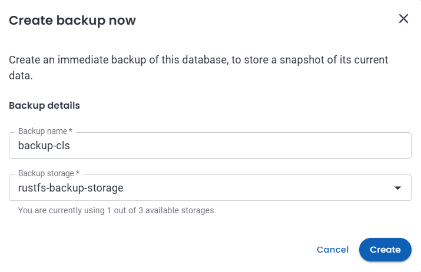

Click **Create**

### Step 5.3: Wait for it to finish

The status will move from **Starting** to **Running**, and finally to **Succeeded**. This can take a minute or two, depending on the size of your database.

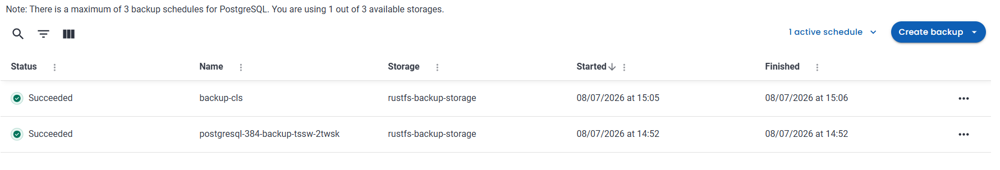

### Step 5.4: Confirm the backup is actually in RustFS

Open the RustFS web console (`http://localhost:9001`) and browse into your bucket. You should see a folder structure like this:

- A timestamped folder ending in `F` (this is your full backup)
- A `backup.history/` folder
- `backup.info` and `backup.info.copy` files

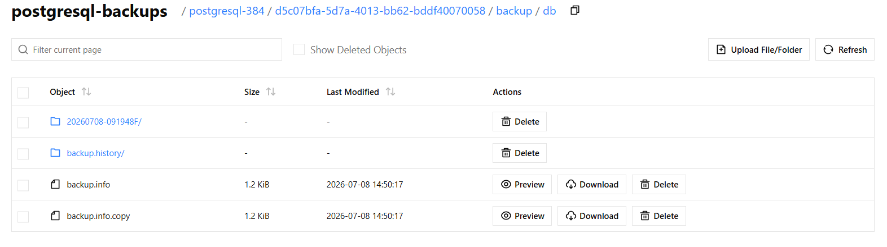

These are created by pgBackRest, the tool OpenEverest uses under the hood to take Postgres backups.

---

## 6. Restoring from a Backup

Now let's confirm the backup actually works, using a simple test with real data.

### Step 6.1: Add some data

Connect to your running Postgres cluster:

```bash
kubectl exec -it <postgresql-instance-pod> -n everest -- psql
```

Create a table and insert two rows:

```sql
CREATE TABLE blog_demo (id SERIAL PRIMARY KEY, note TEXT, created_at TIMESTAMP DEFAULT now());

INSERT INTO blog_demo (note) VALUES ('before-backup-row-1');
INSERT INTO blog_demo (note) VALUES ('before-backup-row-2');

SELECT * FROM blog_demo;
```

You should see 2 rows.

```bash
$ kubectl exec -it postgresql-384-instance1-vvmn-0 -n everest -- bash

bash-5.1$ psql
psql (18.3 - Percona Server for PostgreSQL 18.3.1)
Type "help" for help.

postgres=# CREATE TABLE blog_demo (
    id SERIAL PRIMARY KEY,
    note TEXT,
    created_at TIMESTAMP DEFAULT now()
);
CREATE TABLE

postgres=# INSERT INTO blog_demo (note) VALUES ('before-backup-row-1');
INSERT 0 1

postgres=# INSERT INTO blog_demo (note) VALUES ('before-backup-row-2');
INSERT 0 1

postgres=# SELECT * FROM blog_demo;
 id |        note         |         created_at
----+---------------------+----------------------------
  1 | before-backup-row-1 | 2026-07-08 09:55:34.78151
  2 | before-backup-row-2 | 2026-07-08 09:55:42.07359
(2 rows)
```

### Step 6.2: Take a backup

Follow the steps from the previous section and wait for the status to show **Succeeded**.

### Step 6.3: Add one more row

```sql
INSERT INTO blog_demo (note) VALUES ('after-backup-should-disappear');

SELECT count(*) FROM blog_demo;
```

This should now show `3`. This row is our test — if the restore works, it should disappear.

```bash
$ kubectl exec -it postgresql-384-instance1-vvmn-0 -n everest -- bash

bash-5.1$ psql
psql (18.3 - Percona Server for PostgreSQL 18.3.1)
Type "help" for help.

postgres=# INSERT INTO blog_demo (note) VALUES ('after-backup-should-disappear');
INSERT 0 1

postgres=# SELECT count(*) FROM blog_demo;
 count
-------
     3
(1 row)
```

### Step 6.4: Restore from the backup

Go to the cluster's **Actions** menu and click **Restore from a backup**. Select the backup you just took, then click **Restore**.

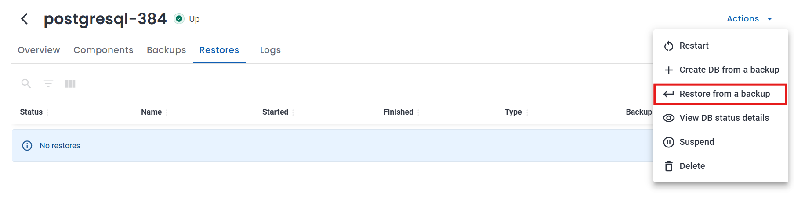

The cluster will briefly go into a restoring state, then come back **Up** once the restore finishes.

### Step 6.5: Verify the data

Reconnect and check:

```bash
kubectl exec -it <postgresql-instance-pod> -n everest -- psql
```

```sql
SELECT * FROM blog_demo;
SELECT count(*) FROM blog_demo;
```

```bash
$ kubectl exec -it postgresql-384-instance1-vvmn-0 -n everest -- bash

bash-5.1$ psql
psql (18.3 - Percona Server for PostgreSQL 18.3.1)
Type "help" for help.

postgres=# SELECT * FROM blog_demo;
 id |        note         |         created_at
----+---------------------+----------------------------
  1 | before-backup-row-1 | 2026-07-08 09:55:34.78151
  2 | before-backup-row-2 | 2026-07-08 09:55:42.07359
(2 rows)

postgres=# SELECT count(*) FROM blog_demo;
 count
-------
     2
(1 row)
```

**Expected result:** `count` is back to `2`. Only `before-backup-row-1` and `before-backup-row-2` remain — `after-backup-should-disappear` is gone. This confirms the restore worked. The cluster's data went back to exactly the state it was in when the backup was taken. 

### 7. Another way to restore: Create DB from a backup

The **Actions** menu also has a second option, **Create DB from a backup**. Instead of restoring into the same cluster, this creates a brand new, separate cluster using the backup as its starting data. Your original cluster keeps running, untouched.

This is useful when you want a separate copy of your data — for testing, staging, or checking older data — without affecting the live database.

To use it: **Actions → Create DB from a backup → select your backup → complete the wizard with a new cluster name.**

---

## 8. Conclusion

In this guide, we set up RustFS as a self-hosted, open-source alternative to cloud storage for OpenEverest backups. We connected it to a PostgreSQL database, took a backup, and confirmed it was actually stored in RustFS. Then we tested a full restore using real data, and confirmed the database came back to exactly the state it was in when the backup was taken.

This gives you a complete, open-source path for backing up and restoring your databases on OpenEverest — without depending on any cloud provider.

If you try this out, we'd love to hear about it. Feel free to join the OpenEverest community and share your experience.


## Join the Community

* **Contribute:** If you want to dive in, check out our [Good First Issues](https://github.com/orgs/openeverest/projects/2) and [repositories](https://github.com/openeverest).
* **Chat:** Join the conversation in the CNCF Slack (channel: [#openeverest-users](https://cloud-native.slack.com/archives/C09RRGZL2UX)).
* **Explore:** See how we're simplifying databases at [openeverest.io/#community](https://openeverest.io/#community).
<div style="display:flex;gap:12px;margin-top:24px;flex-wrap:wrap;">
  <a href="https://cloud-native.slack.com/archives/C09RRGZL2UX" target="_blank" rel="noopener noreferrer" style="display:inline-flex;align-items:center;gap:8px;background-color:#4A154B;color:#fff;text-decoration:none;padding:10px 20px;border-radius:6px;font-weight:600;font-size:15px;">
    <svg xmlns="http://www.w3.org/2000/svg" width="20" height="20" viewBox="0 0 122.8 122.8"><path d="M25.8 77.6c0 7.1-5.8 12.9-12.9 12.9S0 84.7 0 77.6s5.8-12.9 12.9-12.9h12.9v12.9zm6.5 0c0-7.1 5.8-12.9 12.9-12.9s12.9 5.8 12.9 12.9v32.3c0 7.1-5.8 12.9-12.9 12.9s-12.9-5.8-12.9-12.9V77.6z" fill="#e01e5a"/><path d="M45.2 25.8c-7.1 0-12.9-5.8-12.9-12.9S38.1 0 45.2 0s12.9 5.8 12.9 12.9v12.9H45.2zm0 6.5c7.1 0 12.9 5.8 12.9 12.9s-5.8 12.9-12.9 12.9H12.9C5.8 58.1 0 52.3 0 45.2s5.8-12.9 12.9-12.9h32.3z" fill="#36c5f0"/><path d="M97 45.2c0-7.1 5.8-12.9 12.9-12.9s12.9 5.8 12.9 12.9-5.8 12.9-12.9 12.9H97V45.2zm-6.5 0c0 7.1-5.8 12.9-12.9 12.9s-12.9-5.8-12.9-12.9V12.9C64.7 5.8 70.5 0 77.6 0s12.9 5.8 12.9 12.9v32.3z" fill="#2eb67d"/><path d="M77.6 97c7.1 0 12.9 5.8 12.9 12.9s-5.8 12.9-12.9 12.9-12.9-5.8-12.9-12.9V97h12.9zm0-6.5c-7.1 0-12.9-5.8-12.9-12.9s5.8-12.9 12.9-12.9h32.3c7.1 0 12.9 5.8 12.9 12.9s-5.8 12.9-12.9 12.9H77.6z" fill="#ecb22e"/></svg>
    Join Slack
  </a>
  <a href="https://github.com/openeverest/openeverest" target="_blank" rel="noopener noreferrer" style="display:inline-flex;align-items:center;gap:8px;background-color:#24292f;color:#fff;text-decoration:none;padding:10px 20px;border-radius:6px;font-weight:600;font-size:15px;">
    <svg xmlns="http://www.w3.org/2000/svg" width="20" height="20" viewBox="0 0 16 16" fill="#fff"><path d="M8 .25a7.75 7.75 0 1 0 0 15.5A7.75 7.75 0 0 0 8 .25zm0 1.5a6.25 6.25 0 0 1 1.97 12.18c-.31.06-.42-.13-.42-.3v-1.05c0-.36-.01-1.02-.49-1.4 1.62-.18 2.5-.88 2.5-2.57 0-.57-.2-1.1-.53-1.49.05-.14.23-.7-.05-1.47 0 0-.44-.14-1.44.54a5.02 5.02 0 0 0-2.62 0C5.93 6.6 5.49 6.74 5.49 6.74c-.28.77-.1 1.33-.05 1.47-.33.39-.53.92-.53 1.49 0 1.69.88 2.39 2.5 2.57-.31.27-.43.67-.47 1.04-.42.19-1.5.52-2.16-.62 0 0-.39-.71-1.13-.76 0 0-.72-.01-.05.45 0 0 .48.23.82 1.08 0 0 .43 1.32 2.49.87v.75c0 .17-.11.36-.42.3A6.25 6.25 0 0 1 8 1.75z"/></svg>
    Star the Repo
  </a>
</div>

