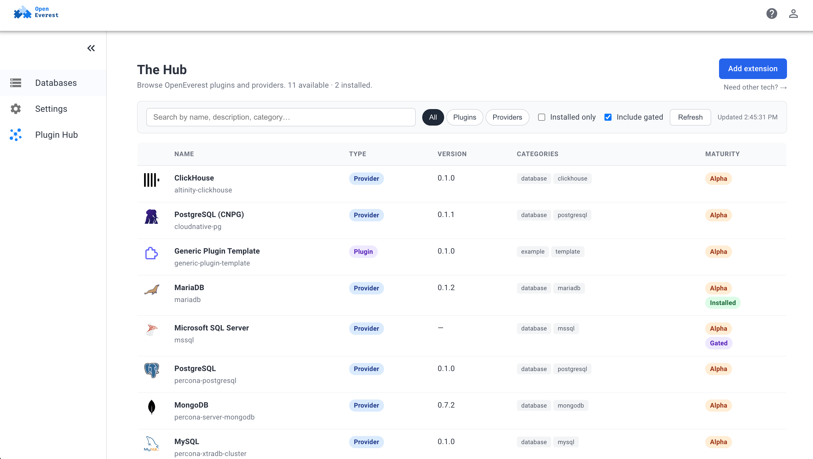
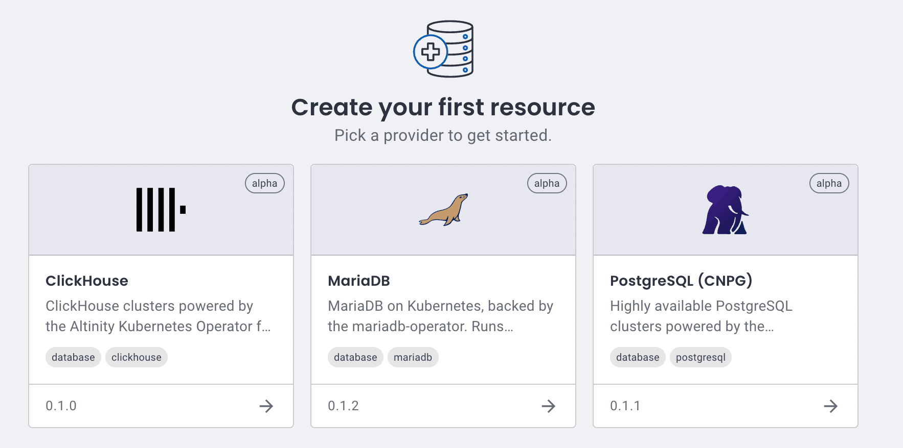
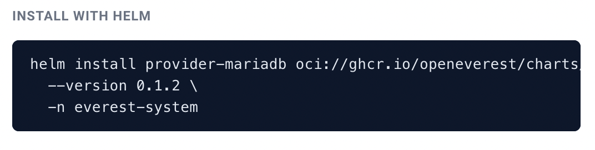

Modular architectures allow users of the product to expand its
capabilities or somehow get additional value. There are good examples
in the open source — take PostgreSQL with its extensions or WordPress
with plugins. And we are no different. In OpenEverest v2 we went all
in and made the core as lightweight as possible, while allowing users
to create plugins. You can read more about it in the [v2 announcement
blog](https://openeverest.io/blog/everest-v2).

But it is not enough to open the floodgates and get plugins. You
should somehow make sure that users will know where to find
information about plugins, how to install those, what is new, etc. We
knew that at some point we will need to have some tool or mechanism to
help with such a discovery. And we came up with the Hub.

As you see from the screenshot — it shows the available providers and
plugins. Some of those were not developed by the core team.

## How it works

There are two main components of the hub:

1. **Hub repo** — the GitHub repository
[`openeverest/hub`](https://github.com/openeverest/hub) that has all
the information
2. **Plugin** — OpenEverest generic plugin that shows the data in the
UI for the user

### Hub repo

First things first — there should be a place where users can share
their plugins and providers with the world. No better place for open
source than to host it all in a GitHub repo. It all started with [the
spec](https://github.com/openeverest/specs/blob/main/specs/007-extension-hub.md) that described the idea and the structure.

To add technology users describe the information about their
OpenEverest extensions in YAML manifest and send the PR. Once merged,
the `index.json` file is put together by the workflow. It contains
information about all the providers and plugins.

Users can read more about publishing their extensions in
[PUBLISHING.md](https://github.com/openeverest/hub/blob/main/PUBLISHING.md).

### Plugin

Since v2 introduced generic plugins, it was a no-brainer for us
to implement a hub via the plugin. A good example of dogfooding.

As a result [`openeverest/plugin-hub`](https://github.com/openeverest/plugin-hub)
appeared. It is a generic plugin that is now deployed by default as a
Helm dependency with OpenEverest v2. It fetches and caches the
`index.json` file from the hub repo, and then shows it in a nice way
that you've seen on a screenshot above.

If you don't have the plugin installed, you will not see nice tiles
with available technologies, but only the names of the providers. So
the plugin is tightly coupled with the core to provide better user
experience.

## What is next

We are far from done. We have various things to work on.

### Design and UI

  <a href="https://github.com/openeverest/plugin-hub/issues/13" target="_blank" rel="noopener noreferrer" style="display:inline-flex;align-items:center;gap:6px;background-color:#24292f;color:#fff;text-decoration:none;padding:4px 12px;border-radius:9999px;font-weight:600;font-size:14px;">🧩 Issue #13</a>

As you might have noticed the UI of the plugin is not following the
one we have in the OpenEverest. Buttons, text fields, labels —
everything is off. We need to align it somehow.

The thing here is that OpenEverest plugin system should expose the UI
artifacts for plugins to consume. We had some attempts and there is an
active discussion about it going
[here](https://github.com/openeverest/plugin-hub/issues/13). This
issue is quite complicated and requires some thought. You are more
than welcome to brainstorm it with us.

### Air gapped environment support

  <a href="https://github.com/openeverest/plugin-hub/issues/12" target="_blank" rel="noopener noreferrer" style="display:inline-flex;align-items:center;gap:6px;background-color:#24292f;color:#fff;text-decoration:none;padding:4px 12px;border-radius:9999px;font-weight:600;font-size:14px;">🔒 Issue #12</a>
  good first issue

A lot of companies with strict security rules and compliance
requirements run their Kubernetes clusters in private networks with no
access to the internet. We should make sure that they still can get
the value of the platform and the plugin. To do that we might need to
allow users to store `index.json` locally in ConfigMap and maybe even
ship it with the plugin.

### Install with UI

  <a href="https://github.com/openeverest/plugin-hub/issues/15" target="_blank" rel="noopener noreferrer" style="display:inline-flex;align-items:center;gap:6px;background-color:#24292f;color:#fff;text-decoration:none;padding:4px 12px;border-radius:9999px;font-weight:600;font-size:14px;">🖱️ Issue #15</a>

The installation of plugins and providers is now done with Helm. You
run a single command that pulls an OCI package and installs
everything. This is what we have today in the plugin's installation
instruction section.

In an ideal world we don't want users to switch to terminal. It should be
possible to install extensions with a click of a button. It is not
hard, but might require elevated permissions for the plugin itself,
which might not be ideal.

### Detect old versions

  <a href="https://github.com/openeverest/plugin-hub/issues/14" target="_blank" rel="noopener noreferrer" style="display:inline-flex;align-items:center;gap:6px;background-color:#24292f;color:#fff;text-decoration:none;padding:4px 12px;border-radius:9999px;font-weight:600;font-size:14px;">🔔 Issue #14</a>
  good first issue

Users can see which plugins and providers are currently installed. We
can enhance this and alert the users about new versions released. It
will be the first step towards some notification system within the
plugin. It can be developed further, where we push notifications about
security vulnerabilities and various extension enhancements.

## Conclusion

As you see, there is a lot of work ahead and we are not stopping on
improving OpenEverest and its ecosystem. We are always eager to learn
about new use cases and opportunities that you see for the platform.

## Join the Community

Want to help shape the Hub and the rest of the OpenEverest ecosystem? There are plenty of ways to get involved:

* **Chat with us:** Join the `#openeverest-users` channel on the CNCF Slack.
* **Connect with maintainers:** Meet the team at our bi-weekly [community meetings](https://github.com/openeverest#openeverest-community-meetings) or reach out to the [maintainers](https://talk.openeverest.tech/30min).
* **Get started:** Follow the [quickstart guide](https://openeverest.io/documentation/current/quick-install.html) to spin up OpenEverest and try the Hub yourself.

  <a href="https://cloud-native.slack.com/archives/C09RRGZL2UX" target="_blank" rel="noopener noreferrer" style="display:inline-flex;align-items:center;gap:8px;background-color:#4A154B;color:#fff;text-decoration:none;padding:10px 20px;border-radius:6px;font-weight:600;font-size:15px;">
    <svg xmlns="http://www.w3.org/2000/svg" width="20" height="20" viewBox="0 0 122.8 122.8"><path d="M25.8 77.6c0 7.1-5.8 12.9-12.9 12.9S0 84.7 0 77.6s5.8-12.9 12.9-12.9h12.9v12.9zm6.5 0c0-7.1 5.8-12.9 12.9-12.9s12.9 5.8 12.9 12.9v32.3c0 7.1-5.8 12.9-12.9 12.9s-12.9-5.8-12.9-12.9V77.6z" fill="#e01e5a"/><path d="M45.2 25.8c-7.1 0-12.9-5.8-12.9-12.9S38.1 0 45.2 0s12.9 5.8 12.9 12.9v12.9H45.2zm0 6.5c7.1 0 12.9 5.8 12.9 12.9s-5.8 12.9-12.9 12.9H12.9C5.8 58.1 0 52.3 0 45.2s5.8-12.9 12.9-12.9h32.3z" fill="#36c5f0"/><path d="M97 45.2c0-7.1 5.8-12.9 12.9-12.9s12.9 5.8 12.9 12.9-5.8 12.9-12.9 12.9H97V45.2zm-6.5 0c0 7.1-5.8 12.9-12.9 12.9s-12.9-5.8-12.9-12.9V12.9C64.7 5.8 70.5 0 77.6 0s12.9 5.8 12.9 12.9v32.3z" fill="#2eb67d"/><path d="M77.6 97c7.1 0 12.9 5.8 12.9 12.9s-5.8 12.9-12.9 12.9-12.9-5.8-12.9-12.9V97h12.9zm0-6.5c-7.1 0-12.9-5.8-12.9-12.9s5.8-12.9 12.9-12.9h32.3c7.1 0 12.9 5.8 12.9 12.9s-5.8 12.9-12.9 12.9H77.6z" fill="#ecb22e"/></svg>
    Join Slack
  </a>
  <a href="https://talk.openeverest.tech/30min" target="_blank" rel="noopener noreferrer" style="display:inline-flex;align-items:center;gap:8px;background-color:#0f6fec;color:#fff;text-decoration:none;padding:10px 20px;border-radius:6px;font-weight:600;font-size:15px;">
    Connect with Maintainers
  </a>
  <a href="https://openeverest.io/documentation/current/quick-install.html" target="_blank" rel="noopener noreferrer" style="display:inline-flex;align-items:center;gap:8px;background-color:#24292f;color:#fff;text-decoration:none;padding:10px 20px;border-radius:6px;font-weight:600;font-size:15px;">
    🚀 Quickstart
  </a>

